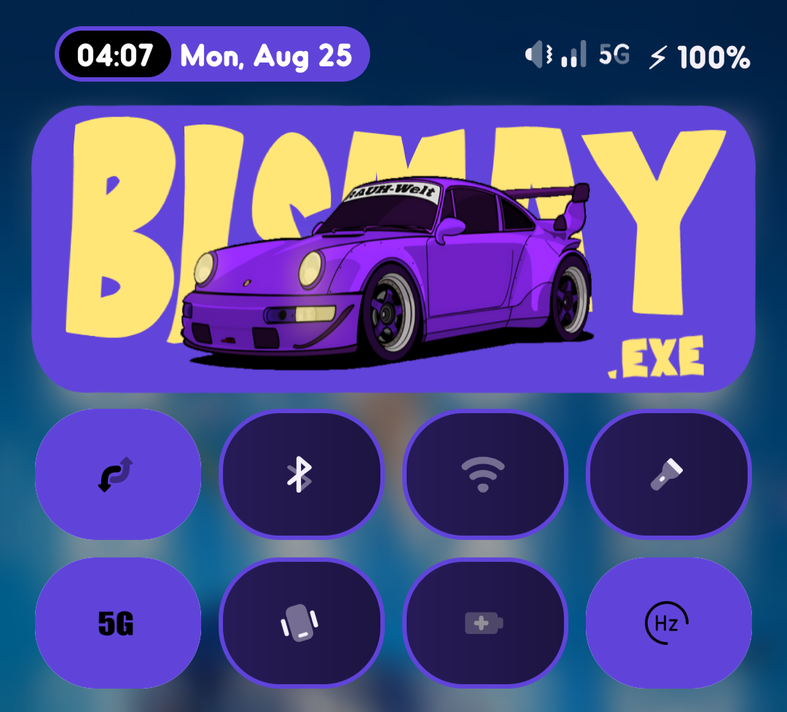

<!-- Banner -->


<p align="center">
  
</p>

<p align="center">
  
  
  
  
</p>

---

## 📸 Preview

<p align="center">
  <table>
    <tr>
      <td align="center">
        <br>
        <b>5G Quick Tile</b>
      </td>
    </tr>
  </table>
</p>

A **simple Android app** that adds a **Quick Settings Tile** to toggle **5G network mode** instantly.  
No digging through menus – just one tap to switch! ⚡

---

## ✅ Features at a Glance

<div align="center">

### 📶 Quick 5G Tile  
Easily toggle 5G from Quick Settings  

---

### ⚡ One Tap Network Switch  
Instantly switch between available networks  

---

### 🔔 Notification Shortcut  
Control 5G directly from notification panel  

---

### 🎨 Minimal UI  
Lightweight, clean, and easy-to-use  

---

### 🔓 Open Source  
Fully transparent codebase on GitHub  

</div>

---

## 🛠️ Tech Stack  

<p align="center">
  
</p>

---

## 📊 GitHub Stats (Project)

<p align="center">
  
</p>

---

## ASCII Banner

<!--ascii-start-->
Font: `block`
Message: `5GTile 📶`
```text
 .________ ________  ___________.__.__          
 |   ____//  _____/  \__    ___/|__|  |   ____  
 |____  \/   \  ___    |    |   |  |  | _/ __ \ 
 /       \    \_\  \   |    |   |  |  |_\  ___/ 
/______  /\______  /   |____|   |__|____/\___  >
       \/        \/                          \/ 
```
<!--ascii-end-->

---


## 🌐 Connect with me

<p align="center"> <a href="https://github.com/Bismay-exe" target="_blank">  </a> <a href="https://instagram.com/bismay.exe" target="_blank">  </a> <a href="https://t.me/bismay_exe" target="_blank">  </a> <a href="https://t.me/BismaysInventory" target="_blank">  </a> </p>
